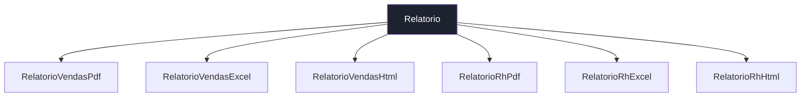
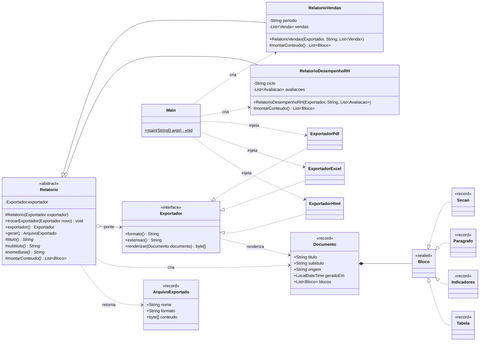
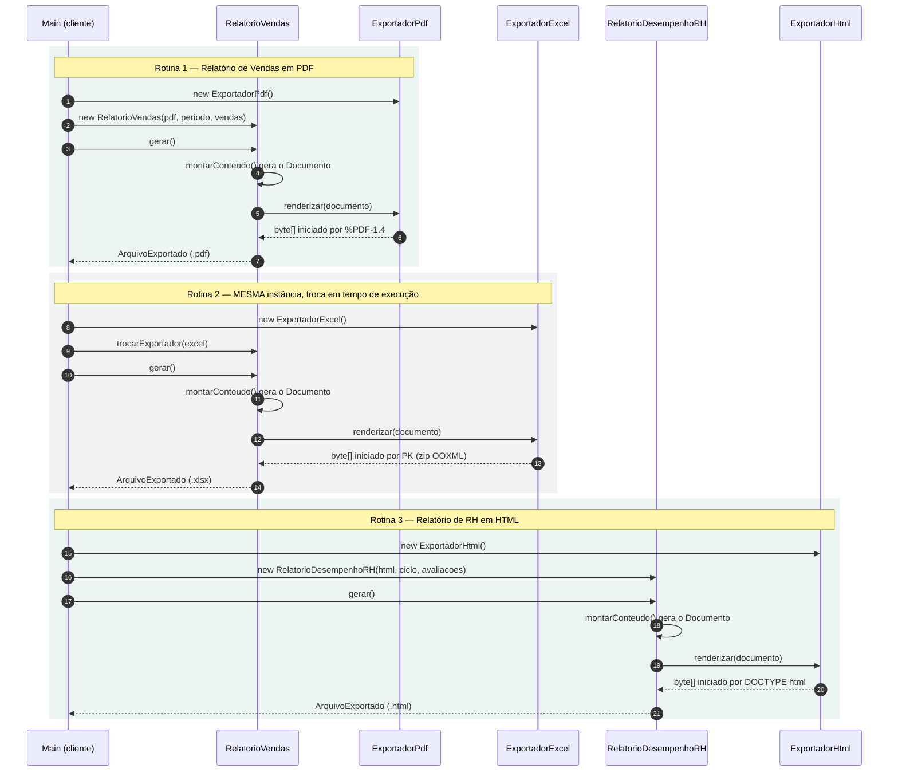

# TechFatec BI · Módulo de Relatórios com Padrão Bridge

   

> **Vídeo da defesa técnica (3–5 min):** [assistir aqui] https://canva.link/8rp3n8yfuav9bkl


Expansão do módulo de relatórios do sistema de inteligência de negócios **TechFatec**. O legado gerava apenas o *Relatório de Vendas* em *PDF*; o novo requisito inclui o *Relatório de Desempenho de RH* e exige que **todo relatório, atual ou futuro, seja exportável para PDF, Excel (XLSX) e HTML**. A solução aplica o padrão estrutural **Bridge (GoF)** para evitar a explosão de subclasses e respeitar o **Princípio Aberto/Fechado**.

O projeto é Java 21 puro, **sem nenhuma biblioteca externa**: os arquivos PDF e XLSX são escritos byte a byte pelos próprios exportadores e abrem normalmente no Adobe Reader, no navegador, no Excel e no LibreOffice.

---

## 1. O problema: explosão de subclasses

Se cada combinação *relatório × formato* virasse uma subclasse, a hierarquia cresceria em **n × m**:



Dois relatórios e três formatos já exigem 6 subclasses, com a lógica de PDF duplicada em duas delas, a de Excel em outras duas, e assim por diante. Um 4º formato (CSV) obrigaria a criar mais 2 classes; um 3º relatório, mais 3. Cada novo eixo **modifica** a hierarquia existente, violando o OCP.

| Cenário | Herança pura (n × m) | Bridge (n + m) |
|---|---|---|
| 2 relatórios × 3 formatos (hoje) | 6 classes | **5 classes** |
| + formato CSV | +2 classes | **+1 classe** |
| + um 3º relatório | +3 classes | **+1 classe** |
| 10 relatórios × 5 formatos | 50 classes | **15 classes** |

## 2. A solução: duas hierarquias ligadas por uma ponte

O Bridge separa o problema em duas dimensões que variam de forma independente:

- **Abstração — O QUE relatar** (`/src/abstracao`): regras de negócio de cada relatório.
- **Implementação — COMO exportar** (`/src/implementacao`): detalhes técnicos de cada formato.

A **ponte** é o campo `private Exportador exportador` da classe `Relatorio`, tipado pela *interface*. O relatório delega a ela toda a formatação e nunca sabe qual formato concreto está usando.

### Mapa de papéis do padrão

| Papel no GoF | Classe | Diretório |
|---|---|---|
| Abstraction | `Relatorio` (abstrata) | `/src/abstracao/` |
| Refined Abstraction | `RelatorioVendas`, `RelatorioDesempenhoRH` | `/src/abstracao/` |
| Implementor | `Exportador` (interface) | `/src/implementacao/` |
| Concrete Implementor | `ExportadorPdf`, `ExportadorExcel`, `ExportadorHtml` | `/src/implementacao/` |
| Contrato que atravessa a ponte | `Documento` (record + blocos *sealed*) | `/src/implementacao/` |
| Client / Composition Root | `Main` | `/src/cliente/` |

### Estrutura de diretórios

```text
techfatec-bridge-relatorios/
├── src/
│   ├── abstracao/                     ← O QUE relatar
│   │   ├── Relatorio.java             Abstraction: guarda a ponte e o Template Method gerar()
│   │   ├── RelatorioVendas.java       Refined Abstraction (relatório legado)
│   │   ├── RelatorioDesempenhoRH.java Refined Abstraction (novo requisito)
│   │   └── ArquivoExportado.java      Resultado da geração (nome, formato, bytes)
│   ├── implementacao/                 ← COMO exportar
│   │   ├── Exportador.java            Implementor (interface)
│   │   ├── Documento.java             Documento canônico, neutro de formato
│   │   ├── ExportadorPdf.java         Concrete Implementor: PDF 1.4 escrito à mão
│   │   ├── ExportadorExcel.java       Concrete Implementor: XLSX (OOXML) escrito à mão
│   │   ├── ExportadorHtml.java        Concrete Implementor: HTML5 autocontido
│   │   └── Formatador.java            Formatação pt-BR compartilhada (package-private)
│   └── cliente/                       ← composição e validação
│       ├── Main.java                  Script de validação das 3 rotinas
│       └── DadosDemo.java             Massa de dados fictícia
├── executar.sh / executar.bat         Compila e executa
├── verificar-di.sh / verificar-di.bat Auditoria automática da regra de DI
└── README.md
```

## 3. Diagrama de classes



Leitura rápida: a única seta que liga as duas hierarquias é a **agregação `Relatorio o--> Exportador`** — essa é a ponte. Todas as setas que chegam às classes concretas saem de `Main`: só o cliente conhece os dois lados.

## 4. Diagrama de sequência (script de validação)



Note que, na rotina 2, o objeto `RelatorioVendas` **não é recriado**: apenas a ponte é redirecionada para outro exportador.

## 5. Injeção de dependência

É vedado instanciar exportadores concretos dentro das classes de relatório. O exportador chega **pelo construtor** e é guardado pelo tipo da interface:

```java
// src/abstracao/Relatorio.java
private Exportador exportador;                        // a ponte (tipo = interface)

protected Relatorio(Exportador exportador) {          // injeção via construtor
    this.exportador = exigir(exportador);             // rejeita null
}

public final void trocarExportador(Exportador novoExportador) {
    this.exportador = exigir(novoExportador);         // troca em tempo de execução
}
```

```java
// src/cliente/Main.java — único lugar onde exportadores concretos são criados
Exportador pdf = new ExportadorPdf();
RelatorioVendas vendas = new RelatorioVendas(pdf, "3º trimestre 2026", DadosDemo.vendas());
vendas.trocarExportador(new ExportadorExcel());
```

A regra é **auditada automaticamente**: `./verificar-di.sh` (ou `verificar-di.bat`) procura qualquer `new Exportador…` ou import de exportador concreto em `/src/abstracao` e falha se encontrar. Resultado atual:

```text
  ✔ src/abstracao: 0 ocorrências de 'new Exportador...' e 0 imports de exportadores concretos

  Onde os exportadores concretos são criados (composition root):
    src/cliente/Main.java:46:  Exportador pdf = new ExportadorPdf();
    src/cliente/Main.java:57:  vendas.trocarExportador(new ExportadorExcel());
    src/cliente/Main.java:64:  RelatorioDesempenhoRH rh = new RelatorioDesempenhoRH(new ExportadorHtml(),
```

## 6. Decisões de projeto

**Documento canônico como contrato da ponte.** Em vez de o relatório chamar métodos como `desenharCelulaPdf()`, ele descreve seu conteúdo com quatro blocos semânticos neutros: `Secao`, `Paragrafo`, `Indicadores` e `Tabela`. Cada exportador traduz esses blocos para o seu formato. A abstração nunca vaza detalhe de formato, e a implementação nunca conhece regra de negócio.

**Blocos `sealed` + `switch` com pattern matching (Java 21).** `Bloco` é uma interface selada. O `switch` de cada exportador é verificado pelo compilador: se alguém criar um novo tipo de bloco (ex.: `Grafico`), todo exportador que ainda não sabe desenhá-lo **deixa de compilar**. O erro aparece na hora do build, não em produção.

**Template Method em `gerar()`.** O método é `final`: todo relatório segue o mesmo fluxo *montar conteúdo → atravessar a ponte → empacotar o arquivo*. As subclasses só decidem o conteúdo.

**Exportadores sem estado.** `renderizar()` não guarda nada entre chamadas (o PDF usa um diagramador local à chamada). Por isso a mesma instância pode ser compartilhada e trocada a qualquer momento com segurança.

**Formatos reais, zero dependências.** O `ExportadorPdf` escreve objetos, fluxos de conteúdo, tabela `xref` e `trailer` do PDF 1.4, com quebra automática de página e repetição do cabeçalho das tabelas. O `ExportadorExcel` monta o pacote OOXML (ZIP com `workbook.xml`, `styles.xml`, planilhas), com uma aba de resumo, uma aba por tabela, cabeçalho congelado, autofiltro e **números gravados como números** (somáveis no Excel). O `ExportadorHtml` gera uma página autocontida, responsiva e com tema claro/escuro automático.

**Rastreabilidade da ponte dentro do arquivo.** Todo arquivo gerado traz um carimbo como `Abstração: RelatorioVendas · Implementação: ExportadorPdf`, provando no próprio artefato qual combinação o produziu.

**Validação por assinatura binária.** O cliente confere os *magic bytes* de cada arquivo (`%PDF-`, `PK\x03\x04`, `<!DOCTYPE html>`), garantindo que a saída é um arquivo real do formato e não texto com extensão trocada.

## 7. Aderência ao SOLID

| Princípio | Onde aparece |
|---|---|
| **S** — Responsabilidade Única | Relatórios cuidam de regra de negócio; exportadores cuidam de formato; `Main` cuida da composição. |
| **O** — Aberto/Fechado | Novo formato = nova classe que implementa `Exportador`. Novo relatório = nova subclasse de `Relatorio`. Nenhuma classe existente é editada. O próprio `RelatorioDesempenhoRH` entrou assim. |
| **L** — Substituição de Liskov | Qualquer `Exportador` substitui outro sem quebrar o relatório — é exatamente o que a rotina 2 demonstra. |
| **I** — Segregação de Interfaces | `Exportador` expõe apenas três métodos, todos usados por todos os formatos. |
| **D** — Inversão de Dependência | `Relatorio` depende da abstração `Exportador`, nunca de `ExportadorPdf`; a dependência concreta é injetada de fora. |

## 8. Como executar

Pré-requisito: **JDK 21+** (`java -version` e `javac -version`).

```bash
# Linux / macOS / Git Bash
./executar.sh
./verificar-di.sh
```

```bat
:: Windows (Prompt de Comando ou PowerShell)
executar.bat
verificar-di.bat
```

**IntelliJ IDEA:** abra a pasta do projeto, clique com o botão direito em `src` → *Mark Directory as* → *Sources Root* e execute `cliente.Main`.

Os arquivos são gravados em `saida/`:

| Rotina | Arquivo gerado |
|---|---|
| 1 | `saida/relatorio-vendas-3-trimestre-2026.pdf` |
| 2 | `saida/relatorio-vendas-3-trimestre-2026.xlsx` |
| 3 | `saida/relatorio-desempenho-rh-ciclo-2026-1.html` |

Saída esperada no console:

```text
  ╔══════════════════════════════════════════════════════════════════╗
  ║  TechFatec BI · Módulo de Relatórios · Padrão Bridge (GoF)       ║
  ║  Abstração: O QUE relatar   ↔   Implementação: COMO exportar     ║
  ╚══════════════════════════════════════════════════════════════════╝

  ► Rotina 1/3 — Relatório de Vendas em PDF
    abstração ............. RelatorioVendas@5caf905d
    implementação ......... ExportadorPdf   (injetada via construtor)
    formato ............... PDF
    arquivo ............... saida/relatorio-vendas-3-trimestre-2026.pdf   (13,5 KB)
    assinatura ............ %PDF-1.4  ✔ PDF válido

  ► Rotina 2/3 — Troca em tempo de execução: o MESMO relatório, agora em Excel
    implementação ......... ExportadorPdf  →  ExportadorExcel   (trocarExportador)
    mesma instância? ...... SIM — RelatorioVendas@5caf905d
    formato ............... Excel (XLSX)
    arquivo ............... saida/relatorio-vendas-3-trimestre-2026.xlsx   (5,2 KB)
    assinatura ............ PK\x03\x04  ✔ pacote Office Open XML (zip)

  ► Rotina 3/3 — Relatório de Desempenho de RH em HTML
    abstração ............. RelatorioDesempenhoRH@5680a178
    implementação ......... ExportadorHtml   (injetada via construtor)
    formato ............... HTML
    arquivo ............... saida/relatorio-desempenho-rh-ciclo-2026-1.html   (6,7 KB)
    assinatura ............ <!DOCTYPE html>  ✔ documento HTML5

  ── Prova de desacoplamento ──────────────────────────────────────────
    abstrações (n) ........ RelatorioVendas, RelatorioDesempenhoRH
    implementações (m) .... ExportadorPdf, ExportadorExcel, ExportadorHtml
    combinações ........... 2 × 3 = 6 saídas possíveis
    herança pura .......... 6 subclasses (n × m) — explosão combinatória
    com Bridge ............ 5 classes concretas (n + m)
    +1 formato (CSV) ...... herança +2 classes · Bridge +1 classe, zero edição (OCP)
    +1 relatório .......... herança +3 classes · Bridge +1 classe, zero edição (OCP)
```

O hash depois do `@` muda a cada execução; o que importa é ele ser **igual** nas rotinas 1 e 2.

## 9. Como estender

**Novo formato (ex.: CSV)** — uma classe nova em `/src/implementacao`, nada mais:

```java
public final class ExportadorCsv implements Exportador {
    public String formato()  { return "CSV"; }
    public String extensao() { return "csv"; }

    public byte[] renderizar(Documento documento) {
        StringBuilder csv = new StringBuilder();
        for (Documento.Bloco bloco : documento.blocos()) {
            if (bloco instanceof Documento.Tabela t) {
                csv.append(String.join(";", t.colunas())).append('\n');
                for (List<Object> linha : t.linhas()) {
                    csv.append(linha.stream().map(String::valueOf).collect(Collectors.joining(";"))).append('\n');
                }
            }
        }
        return csv.toString().getBytes(StandardCharsets.UTF_8);
    }
}
```

Instantaneamente, **todos** os relatórios passam a exportar CSV: `new RelatorioVendas(new ExportadorCsv(), ...)`.

**Novo relatório (ex.: Estoque)** — uma subclasse de `Relatorio` em `/src/abstracao` implementando `titulo()`, `subtitulo()`, `nomeBase()` e `montarConteudo()`. Ele já nasce exportável para PDF, Excel e HTML.

---

**Autor:** Endrigo — Análise e Desenvolvimento de Sistemas · FATEC Zona Leste
**Disciplina:** Engenharia de Software · Padrões de Projeto (GoF)
